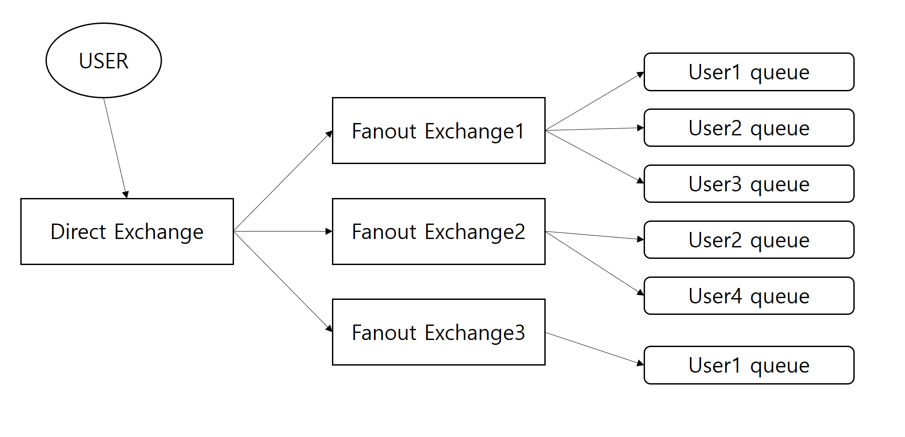

# RSocket RabbitMQ Webflux chat

## 기술 스택

#### RabbitMQ

Message를 비동기적으로 받아서 처리하기 위해서 사용했다.

#### RSocket

Webflux에서 TCP의 Byte 단위 Backpressure을 사용하기엔 Backpressure가 원하던 대로 동작하지 않기 때문에 Logical 단위의 Backpressure를 지원하는 RSocket을 사용했다.

#### MongoDB

비동기 논 블록킹을 지원하는 대표적인 NoSQL인 MongoDB를 사용했다.

 

## Flow

### 채팅방 생성

1. 유저 Queue를 생성한다.
2. 채팅방의 모든 유저들에게 메세지를 전송하기 위해서 Fanout Exchange 생성한다.
3. Direct Exchange와 Fanout Exchange를 바인딩 해준다.
4. Fanout Exchage와 User Queue(채팅방을 개설한 사람)를 연결한다.

### 채팅방 입장

1. 채팅방에 해당하는 UserQueue를 생성한다.
2. UserQueue와 해당 채팅방의 Fanout Exchange와 연결한다.

### 채팅 전송

1. User가 Direct Exchange에 Message를 Publish한다.
2. Direct Exchange는 Routing Key(채팅방 id)에 의해 특정 Fanout Exchange에게 메세지를 라우팅 한다.
3. Fanout Exchange는 해당 채팅방의 UserQueue들에게 메세지를 전송한다.
4. 해당 채팅방에 참가한 사람들이 메세지를 받게 된다.